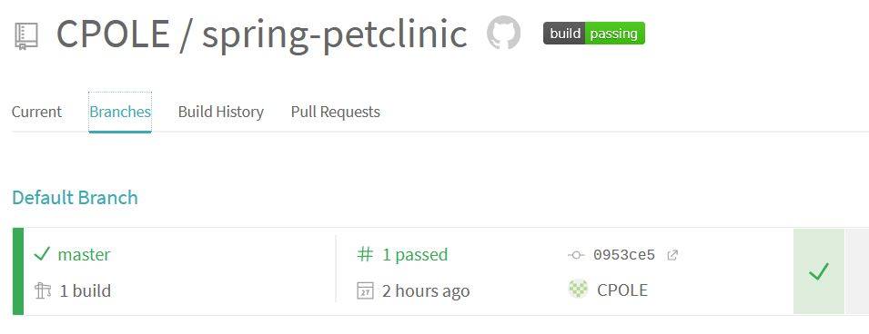
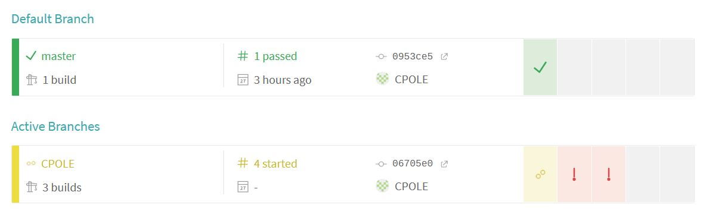
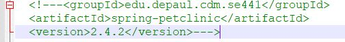

Christopher Pole, ID# 1941713

- [5 pts] Github repo with fork

- [5 pts] Travis dashboard with successful build

- [5 pts] POM with changed coordinates

- [5 pts] Travis dashboard with successful (sic) build (failed)

- [5 pts] Github repo with readme showing failed build

- [5 pts] Travis dashboard with failed build

- [5 pts] POM with fixed coordinates

- [5 pts] Travis dashboard with successful (sic) build (failed)

- [error] build error/stall

https://github.com/CPOLE/spring-petclinic/tree/CPOLE

https://travis-ci.com/github/CPOLE/spring-petclinic/branches
